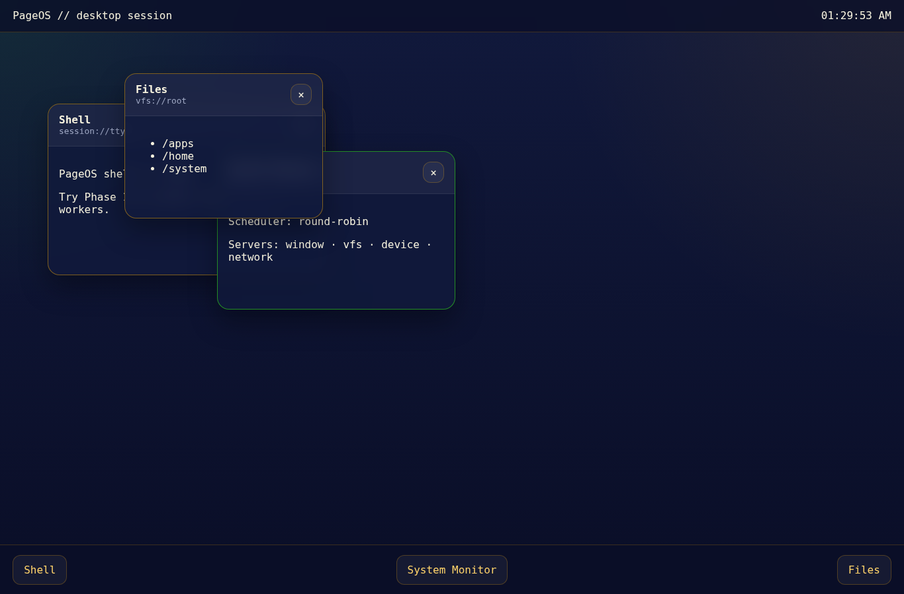
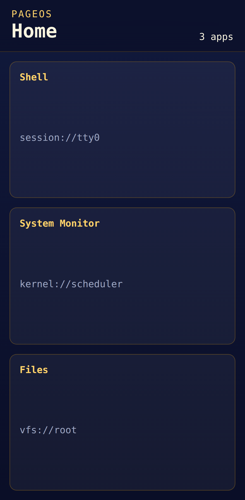

# PageOS-M

PageOS-M is the Phase 0 foundation for a browser-hosted microkernel-style teaching OS. It bootstraps a plain WebAssembly kernel from a service worker, renders a retro-modern compositor shell with desktop/mobile layouts, and scaffolds the Rust/TypeScript monorepo needed for later phases.

## Highlights

- Rust `no_std` kernel, servers, apps, and shared ABI crates in a single Cargo workspace
- TypeScript/Vite shell with responsive desktop/mobile compositor modes
- Service-worker-hosted kernel boot handshake and typed CRT boot log playback
- Playwright boot coverage and GitHub Actions build/e2e/deploy workflows
- Architecture, convention, and roadmap documentation for phases 0 through 8

## Repository Layout

- `kernel/`: PageOS microkernel exports and scheduling/process placeholders
- `servers/`: window, VFS, device, and network server skeleton crates
- `apps/`: shell, terminal, editor, file manager, system monitor, settings, and calculator app skeleton crates
- `lib/`: ABI, runtime, and filesystem shared Rust crates
- `shell/`: browser shell, compositor, drivers, boot UI, and service worker bridge
- `docs/`: architecture, design, specs, task tree, and conventions
- `tests/`: Playwright end-to-end tests and browser-unit placeholders
- `scripts/`: Rust WASM build orchestration and deployment checks

## Tooling

- Node 20 (`.nvmrc`)
- pnpm 9.15.3
- Rust stable + `wasm32-unknown-unknown`
- Vite 5
- Playwright

## Getting Started

```bash
corepack enable
pnpm install
cargo test --workspace
cargo build --workspace --target wasm32-unknown-unknown
pnpm build
pnpm dev
```

## Boot Experience

Phase 0 provides the following visible flow:

1. black splash with PageOS logo fade-in (`0.0s–0.5s`)
2. CRT terminal log screen driven by boot log strings read from `kernel.wasm`
3. desktop shell on widths `>= 768px`
4. mobile launcher/fullscreen app flow on widths `< 768px`

## Screenshots

Desktop and mobile screenshots are stored in `docs/assets/screenshots/` and embedded below after validation.




## Documentation Entry Points

- Architecture overview: `docs/architecture/overview.md`
- Task guide: `docs/tasks/README.md`
- Phase 0 roadmap: `docs/tasks/phase-0-foundation.md`
- Coding conventions: `docs/conventions/`
- Specs index: `docs/specs/INDEX.md`

## Validation Targets

- `cargo test --workspace`
- `cargo build --workspace --target wasm32-unknown-unknown`
- `pnpm build`
- `pnpm test:e2e`

## Phase 0 Completion Matrix

- [x] Directory structure and file skeletons exist across Rust, TypeScript, docs, scripts, and CI
- [x] pnpm/Vite/Playwright workspace is configured
- [x] Cargo workspace with kernel, servers, apps, and shared crates is configured
- [x] Service worker boots the kernel WASM and surfaces boot logs to the shell
- [x] Desktop mode renders draggable sample windows
- [x] Mobile mode renders launcher cards and fullscreen transitions
- [x] CI workflows exist for build, e2e, and Pages deploy
- [x] Architecture/task documentation and roadmap are committed

## Notes on Ambiguity

The original prompt mixes the public `PageOS` repository name with this working repository (`PageOS-M`). Phase 0 uses repository-relative GitHub Pages base paths so deployments work in either location.
